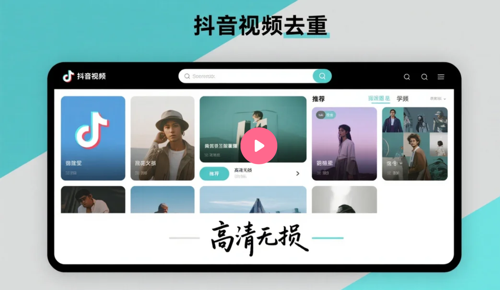
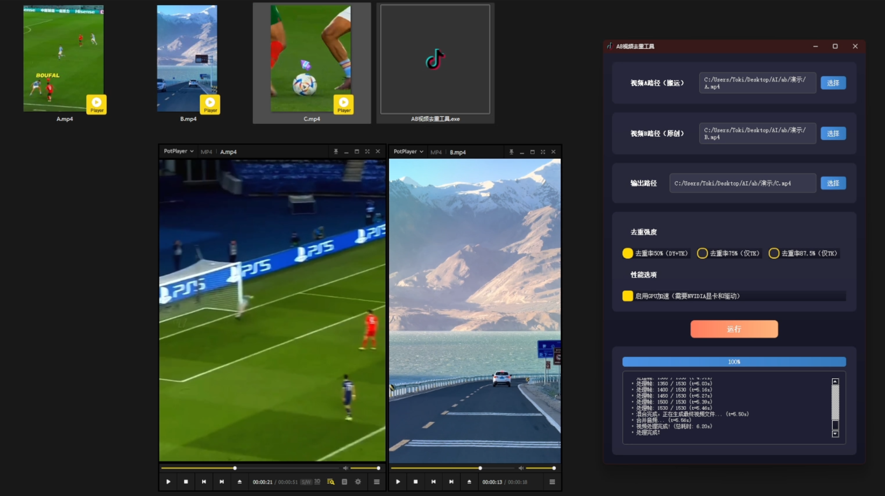

# AB 视频去重工具: 独创高帧率抽帧混合去重

[简体中文](./README.md) | [English](./README_en.md)

[](https://github.com/toki-plus/AB-Video-Deduplicator/stargazers)
[](https://github.com/toki-plus/AB-Video-Deduplicator/network/members)
[](https://choosealicense.com/licenses/mit/)
[](https://github.com/toki-plus/AB-Video-Deduplicator/pulls)

> ### ⚠️ 重要声明
> 此开源版本为早期版本，仅供技术研究与学习交流，请勿用于任何非法用途。由于平台算法更新，去重效果可能无法满足当前需求。

**AB视频去重工具** 是一款专为视频创作者设计的开源桌面应用，它通过创新的“高帧率抽帧混合”技术，从根本上重构视频数据指纹，以规避抖音、TikTok等主流短视频平台的原创度检测和查重机制。

<p align="center">
  <a href="https://www.bilibili.com/video/BV1HwgrzbEow" target="_blank">
    
  </a>
  <br>
  <em>(点击封面图跳转到 B 站观看高清演示视频)</em>
</p>

---

## 💡 工作原理

传统的视频去重方法（如添加滤镜、缩放、镜像）效果越来越有限。本工具采用了一种更为底层的“抽帧混合”策略：

1.  **输入两个视频**：
    *   **视频 A (内容视频)**：你想要发布的目标视频。
    *   **视频 B (素材视频)**：一个与视频A内容无关的原创实拍视频。

2.  **生成高帧率视频**：工具会创建一个高帧率（例如 60/120/240 fps）的空白视频流。

3.  **智能抽帧插入**：工具会按照特定算法，将 **视频 A** 的帧逐一插入到高帧率视频流的 **关键位置**，同时在两个 A 帧之间用 **视频 B** 的帧进行填充。

4.  **最终效果**：由于平台压缩机制，观众在手机上看到的仍然是流畅的 **视频 A** 的画面。但从文件数据层面看，新生成的视频已包含了大量来自 **视频 B** 的帧，其 MD5 和数据指纹与原视频完全不同，从而达到深度去重的目的。

| 去重强度 | 目标FPS | A:B 帧大致比例 |
| :--- | :---: | :---: |
| **50%** | 60 | 1 : 1 |
| **75%** | 120 | 1 : 3 |
| **87.5%**| 240 | 1 : 7 |

## ✨ 核心功能

-   **直观的图形界面**：使用 PyQt5 构建，操作简单，无需命令行知识。
-   **三种去重强度**：提供 50% (60fps), 75% (120fps), 87.5% (240fps) 三种模式。
-   **🚀 NVIDIA GPU 加速**：支持使用 NVENC 硬件编码，大幅提升视频处理速度。
-   **自动分辨率匹配**：自动将视频 B 的分辨率调整为与视频 A 一致。
-   **音频保留**：完整保留视频 A 的原始音轨。
-   **实时进度与日志**：清晰展示处理进度和详细日志信息。
-   **跨平台运行**：在 Windows, macOS, Linux 上均可运行（需正确安装依赖）。

## 📸 软件截图

<p align="center">
  
  <br>
  <em>简洁直观的软件主界面。</em>
</p>

## 🚀 快速开始

### 系统要求

1.  **Python**: 3.8 或更高版本。
2.  **FFmpeg**: **必须安装** 并且已将其可执行文件路径添加到系统的环境变量（`PATH`）中。
    -   Windows: 可从 [gyan.dev](https://www.gyan.dev/ffmpeg/builds/) 下载。
    -   macOS: `brew install ffmpeg`
    -   Linux: `sudo apt update && sudo apt install ffmpeg`

### 安装与启动

1.  **克隆本仓库：**
    ```bash
    git clone https://github.com/toki-plus/AB-Video-Deduplicator.git
    cd AB-Video-Deduplicator
    ```

2.  **创建并激活虚拟环境 (推荐)：**
    ```bash
    python -m venv venv
    # Windows 系统
    venv\Scripts\activate
    # macOS/Linux 系统
    source venv/bin/activate
    ```

3.  **安装依赖库：**
    ```bash
    pip install -r requirements.txt
    ```
4.  **生成 Qt 资源文件**
    本应用的图标资源需要手动编译。请运行以下命令：
    ```bash
    pyrcc5 src/resources.qrc -o src/resources.py
    ```
5.  **运行程序：**
    ```bash
    python src/main.py
    ```

## 📖 使用指南

1.  点击“选择视频A”，选择你的**内容视频**。
2.  点击“选择视频B”，选择你的**素材视频**。
3.  在“选择去重强度”下拉菜单中选择一个模式（推荐从 60fps 开始测试）。
4.  如果你有NVIDIA显卡，勾选“开启GPU加速”。
5.  点击“开始处理”，等待进度条完成。
6.  处理完成的视频将保存在 `output` 文件夹中。

## 👨‍💻 关于作者 (About the Author)

您好，我是Toki+，本项目作者。

> **前四大(毕马威)网络安全顾问 | Python自动化解决方案专家**

我专注于为内容创作者和跨境业务提供降本增效的定制化工具。凭借在毕马威服务顶级金融与消费品公司（如贝莱德、万豪、LVMH、壳牌等）的经验，我擅长将复杂的业务需求转化为稳定、高效的自动化解决方案。

这个开源项目是我的技术能力展示之一。如果您需要更专业的服务，我提供：

| 服务类型 | 描述 | 适合人群 |
| :--- | :--- | :--- |
| **🛠️ 定制化工具开发** | 根据您的独特业务流程，开发专属的桌面GUI工具或自动化脚本。 | 需要解决特定痛点、有明确需求的企业或个人。 |
| **💡 技术咨询** | 1对1沟通，帮您梳理技术需求，规划自动化方案，评估项目可行性。 | 有想法但不知如何实现，或需要专业技术建议的决策者。|
| **📈 现有工具二开** | 在我的开源项目基础上，为您增加或修改功能，快速实现您的想法。 | 认可我的项目，但需要更多个性化功能的用户。 |

## 💼 寻求自动化工具定制开发？

这个开源项目是我在桌面自动化和内容创作工具领域技术能力的展示。如果你觉得这个项目对你有帮助，并希望获得更符合你业务需求的定制化解决方案，我非常乐意提供付费的定制开发服务。

服务范围包括但不限于：
-   **对接不同平台**：如YouTube、B站、小红书、Twitter等平台的自动化操作。
-   **功能扩展**：为现有工作流增加更多高级功能，如更新的去重算法。
-   **全新工具开发**：根据你的需求，从零开始打造专属的自动化工具。
-   **云端部署与API开发**：将工作流部署在服务器上，实现7x24小时无人值守运行。

**欢迎与我联系，让我们一起打造能为你创造价值的工具！**

<p align="center">
  <strong>业务定制与技术交流，请添加：</strong>
</p>
<table align="center">
  <tr>
    <td align="center">
      
      <br />
      <sub><b>个人微信</b></sub>
      <br />
      <sub>微信号: toki-plus (请备注“GitHub工具定制”)</sub>
    </td>
    <td align="center">
      
      <br />
      <sub><b>公众号</b></sub>
      <br />
      <sub>获取最新技术分享与项目更新</sub>
    </td>
  </tr>
</table>

## 📂 我的其他开源项目

-   **[AI-TTV-Workflow](https://github.com/toki-plus/ai-ttv-workflow)**: 一款AI驱动的文本转视频工具，能将任意文案自动转化为带有配音、字幕和封面的短视频，支持AI文案提取、二创和翻译。
-   **[Video Mover](https://github.com/toki-plus/video-mover)**: 一个强大的、全自动化的内容创作流水线工具。它可以自动监听、下载指定的博主发布的视频，进行深度、多维度的视频去重处理，并利用AI大模型生成爆款标题，最终自动发布到不同平台。

## 🤝 参与贡献

欢迎任何形式的贡献！如果你有新的功能点子、发现了Bug，或者有任何改进建议，请：
-   提交一个 [Issue](https://github.com/toki-plus/AB-Video-Deduplicator/issues) 进行讨论。
-   Fork 本仓库并提交 [Pull Request](https://github.com/toki-plus/AB-Video-Deduplicator/pulls)。

如果这个项目对你有帮助，请不吝点亮一颗 ⭐！

## 📜 开源协议

本项目基于 MIT 协议开源。详情请见 [LICENSE](LICENSE) 文件。

