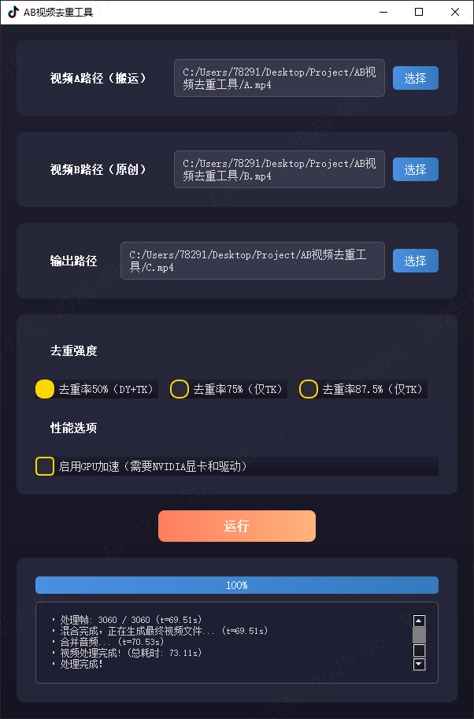

# AB 视频去重工具 (AB Video Deduplicator)

[](https://www.python.org/downloads/)
[](https://opensource.org/licenses/MIT)

---

### ⚠️ 重要声明 (Important Disclaimer)

> **此项目仅供研究学习，请勿用于非法用途。若使用者将此项目用于非法用途，导致的法律问题由使用者个人承担。**
>
> **当前软件已更新多个版本，此开源版本为最初版本，去重可能达不到想要的效果，开源此项目仅供大家交流学习。**
>
> **需要进短视频创作技术交流群的朋友可以到最下方联系我。**
> 
> **对全自动搬运项目感兴趣的朋友可以移步我的另一个项目：https://github.com/toki-plus/video-mover**

---

**AB视频去重工具** 是一款专为视频创作者设计的开源桌面应用，它通过创新的“高帧率抽帧混合”技术，从根本上重构视频数据指纹，以规避抖音、TikTok等主流短视频平台的原创度检测和查重机制。本项目基于 Python, PyQt5 和 FFmpeg 构建，提供直观的图形用户界面和NVIDIA GPU加速选项，旨在为二次创作和内容分发提供一个高效、可靠的技术解决方案。

### ✨ 项目截图

>  
> 
> 使用演示（点击图片播放👇）
> 
> [](https://www.bilibili.com/video/BV1HwgrzbEow)
>
>  **需要最新版AB视频去重工具的朋友可以到最下方联系我**
>
> 

### 🚀 工作原理

传统的视频去重方法（如添加滤镜、缩放、镜像）的效果越来越有限。本工具采用了一种更为底层的“抽帧混合”策略：

1.  **输入两个视频**：
    *   **视频 A (内容视频)**：你想要发布的目标视频。
    *   **视频 B (背景视频)**：一个原创的、与视频A内容无关的实拍视频。

2.  **生成高帧率视频**：
    *   工具会创建一个高帧率（例如 60/120/240 fps）的空白视频流，其时长与视频 A 相同。

3.  **智能抽帧插入**：
    *   工具会按照特定算法，将 **视频 A** 的帧逐一插入到这个高帧率视频流的 **关键位置**。
    *   在两个视频 A 的帧之间，用 **视频 B** 的帧进行填充。

4.  **最终效果**：
    *   由于平台压缩机制，会将高帧率的视频按照一定的规律压缩成低帧率的视频展示给观众，以适配更广泛的机型，因此观众看到的内容是 **视频 A** 的画面。
    *   但从文件数据层面看，新生成的视频 C 包含了大量来自 **视频 B** 的帧，其 MD5 值和指纹信息与原始视频 A 完全不同，从而降低与原视频的重复率。
    *   去重强度（60/120/240fps）越高，插入的视频 A 帧的间隔就越大，填充的视频 B 帧就越多，去重效果越强。
    *   关于压缩规律，可以结合 `utils/gen_test_video.py` 和 `extract_frames.py` 对不同平台进行测试。

### 🔬 核心算法：智能抽帧与混合 (Core Algorithm: Intelligent Frame Sampling and Blending)

本工具去重效果的核心在于其独特的帧调度算法，该算法在主处理线程 `VideoProcessor` 中实现，并由 `get_a_positions` 函数精确控制。其基本思想是：**在高帧率的输出视频中，稀疏但有规律地插入源视频A的帧，其余位置全部用背景视频B的帧填充。**

算法的关键在于如何计算视频A的每一帧应该被放置在新视频C的哪个位置上。这个计算由 `get_a_positions(fps, N_a)` 函数完成，其中 `fps` 代表用户选择的去重强度（60/120/240），`N_a` 是视频A的总帧数。

#### 模式一：50%去重率 (60fps)
-   **算法规则**: `m if m <= 2 else 2 + 2 * (m - 2)`
-   **帧序列模式**: 前3帧保持 `A, A, A` 以确保视频开头的流畅性，之后严格按照 `A, B, A, B...` 的模式交替。

#### 模式二：75%去重率 (120fps)
-   **算法规则**: `m if m <= 1 else 1 + 4 * (m - 1)`
-   **帧序列模式**: 开头为 `A, A`，之后严格按照 `A, B, B, B, A, B, B, B...` 的模式，即每1个A帧后面填充3个B帧。

#### 模式三：87.5%去重率 (240fps)
-   **算法规则**: 开头为 `A, A`，后续插入间隔按照 `[8, 9, 7]` 的序列循环。
-   **帧序列模式**: 在插入一个A帧后，下一个A帧的位置会间隔7、8或9个B帧。

| 去重强度 | 目标FPS | A:B 帧大致比例 |
| :--- | :---: | :---: |
| **50%** | 60 | 1 : 1 |
| **75%** | 120 | 1 : 3 |
| **87.5%**| 240 | 1 : 7 |

### ⭐ 核心功能

- **直观的图形界面**：使用 PyQt5 构建，操作简单，无需命令行知识。
- **三种去重强度**：
    - **50% (60fps)**
    - **75% (120fps)**
    - **87.5% (240fps)**
- **NVIDIA GPU 加速**：支持使用 NVENC 硬件编码，大幅提升视频处理速度。
- **自动分辨率匹配**：自动将视频 B 的分辨率调整为与视频 A 一致。
- **音频保留**：完整保留视频 A 的原始音轨。
- **实时进度与日志**：清晰展示处理进度和详细日志信息。
- **跨平台运行**：在 Windows, macOS, Linux 上均可运行（需正确安装依赖）。

### 🛠️ 环境依赖

在运行本工具前，请确保你的系统已安装以下软件：

1.  **Python**: 3.8 或更高版本。
2.  **FFmpeg**: **必须安装** 并且已将其可执行文件路径添加到系统的环境变量（`PATH`）中。
    -   Windows: 可从 [gyan.dev](https://www.gyan.dev/ffmpeg/builds/) 下载。
    -   macOS: `brew install ffmpeg`
    -   Linux: `sudo apt update && sudo apt install ffmpeg`

### ⚙️ 安装与使用

1.  **克隆本仓库**
    ```bash
    git clone https://github.com/toki-plus/AB-Video-Deduplicator.git
    cd AB-Video-Deduplicator
    ```
    
2.  **创建并激活虚拟环境 (推荐)**
    ```bash
    # Windows
    python -m venv venv
    .\venv\Scripts\activate

    # macOS / Linux
    python3 -m venv venv
    source venv/bin/activate
    ```

3.  **安装 Python 依赖**
    ```bash
    pip install -r requirements.txt
    ```

4.  **生成 Qt 资源文件**
    本应用的图标资源需要手动编译。请运行以下命令：
    ```bash
    # 确保你在 src 目录下运行，或者相应地调整路径
    pyrcc5 src/resources.qrc -o src/resources.py
    ```

5.  **运行主程序**
    ```bash
    python src/main.py
    ```

### 🧰 辅助工具脚本

项目 `utils/` 目录下提供了一些实用脚本，方便你进行测试和分析。

- **`gen_test_video.py`**: 生成一个带有帧序号的测试视频。用于配合`extract_frames.py`测试不同平台对视频帧的保留序列，这个脚本非常有用。
    ```bash
    python utils/gen_test_video.py
    ```
    
- **`extract_frames.py`**: 将一个视频拆解成一帧帧的图片。你可以用它来分析最终生成的视频 C 的帧结构，验证去重效果。
  
    ```bash
    # 示例：将 output.mp4 拆解到 "frames_output" 文件夹
    python utils/extract_frames.py -i output.mp4 -o frames_output
    ```

### 📦 打包为可执行文件 (可选)

如果你想将应用打包成一个独立的 `.exe` 文件（Windows），可以使用 `PyInstaller`。

1. 安装 PyInstaller
   
```bash
pip install pyinstaller
```

2. 打包命令

```bash
# -F: 打包成单文件
# -w: 无命令行窗口
# -i: 指定图标
pyinstaller --name "AB视频去重工具" --noconfirm --onefile --windowed --icon "assets/logo.ico" src/main.py
```

### 📝 许可证

本项目采用 [MIT License](LICENSE) 开源。

### 💬 交流

<table>
    <td align="center">
        <a href="https://llxoxll.com/">
            
            <br />
            <sub><b>微信</b></sub>
        </a>
    </td>
    <td align="center">
        <a href="https://llxoxll.com/">
            
            <br />
            <sub><b>公众号</b></sub>
        </a>
    </td>
    <td align="center">
        <a href="https://llxoxll.com/">
            
            <br />
            <sub><b>赞赏码</b></sub>
        </a>
    </td>

</table>


