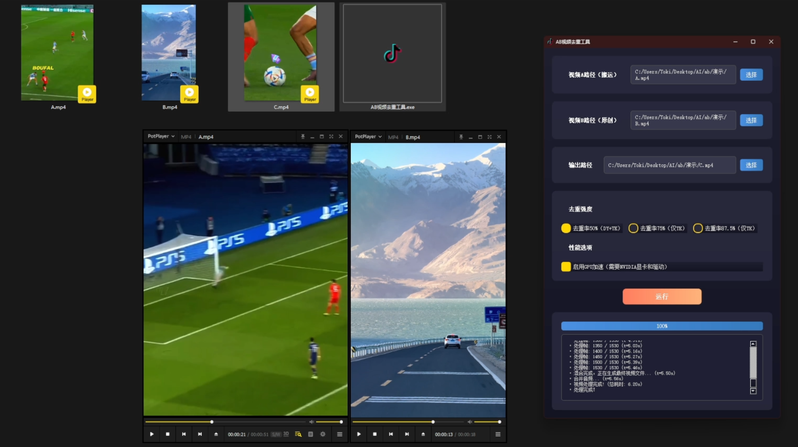

# AB Video Processor

[简体中文](./README.md) | [English](./README_en.md)

A desktop tool for frame-mixing, transcoding, and visual-feature experiments.

The project samples, mixes, and re-encodes frames from two videos to evaluate how frame rate, encoding settings, and GPU acceleration affect the visual and data characteristics of the output. The repository name `AB-Video-Deduplicator` is the project's original name; it is now maintained as AB Video Processor.

> Process only media that you are authorized to use. This is an early experimental release intended for technical research and learning only. It is not intended to bypass platform review, copyright detection, or other security controls.

## Context

Video production workflows often need repeatable experiments across frame rates, resolutions, mixing strategies, and encoding parameters. Running individual FFmpeg commands makes iteration difficult for non-technical users.

This project packages the workflow in a desktop interface with reusable settings and progress reporting, so the same experiment can be quickly reproduced across different source material.

## Capabilities

- Inspect source media metadata (resolution, frame rate, duration, codec)
- Sample and mix frames from two videos, with three processing profiles: 50% (60fps), 75% (120fps), and 87.5% (240fps)
- Automatically align the material video's resolution to the content video, unifying frame rate and encoding parameters
- Fully preserve the original audio track of the content video
- Use NVIDIA NVENC hardware encoding when supported, significantly speeding up processing
- PyQt5 interface with real-time progress and detailed logs — no command-line knowledge required
- Runs on Windows, macOS, and Linux (with dependencies correctly installed)

## 📸 Screenshots

<p align="center">
  <a href="https://www.bilibili.com/video/BV1HwgrzbEow" target="_blank">
    
  </a>
  <br>
  <em>Processing demo (click the cover to watch the demo video on Bilibili)</em>
</p>

<p align="center">
  
  <br>
  <em>Main application UI</em>
</p>

## Processing Flow

```text
Video A + Video B
    -> Media inspection
    -> Resolution alignment
    -> Frame sampling and mixing
    -> FFmpeg encoding
    -> Output validation
```

### Frame-Blending Principle

Instead of surface-level modifications such as filters or scaling, the tool applies a lower-level "high-frame-rate frame sampling and blending" strategy:

1. **Two input videos**: a content video A and an independent material video B.
2. **Build a high-frame-rate output stream**: a target stream at 60 / 120 / 240 fps.
3. **Algorithmic frame insertion**: frames from video A are placed at key positions of the output stream, while gaps between adjacent A frames are filled with frames from video B.
4. **Re-encode the output**: when decoded at the high frame rate, human perception still sees video A playing continuously; at the file-data level, however, the output contains a substantial number of frames from video B, so its MD5 and data characteristics differ completely from the source file.

Frame composition per processing profile:

| Profile | Target FPS | Approx. A:B Frame Ratio |
| :--- | :---: | :---: |
| **50%** | 60 | 1 : 1 |
| **75%** | 120 | 1 : 3 |
| **87.5%** | 240 | 1 : 7 |

Core technologies: Python, PyQt5, NumPy, OpenCV, and FFmpeg.

## Quick Start

### Requirements

- Python 3.8+
- FFmpeg available on `PATH` (Windows: download from [gyan.dev](https://www.gyan.dev/ffmpeg/builds/); macOS: `brew install ffmpeg`; Linux: `sudo apt install ffmpeg`)

```bash
git clone https://github.com/toki-plus/AB-Video-Deduplicator.git
cd AB-Video-Deduplicator
python -m venv venv
```

After activating the virtual environment:

```bash
pip install -r requirements.txt
pyrcc5 src/resources.qrc -o src/resources.py   # compile Qt icon resources
python src/main.py
```

## Usage

1. Select two video sources you are authorized to process (content video A and material video B).
2. Choose a processing profile (start with the 60fps profile for testing) and an output directory.
3. Enable GPU acceleration when a compatible NVIDIA and FFmpeg environment is available.
4. Run the job; results are saved to the `output` folder. Validate the output video, audio, and duration.

## Current Limitations

- Results depend on source resolution, frame rate, and encoding format.
- GPU acceleration depends on the local FFmpeg build and driver environment.
- The repository includes basic test utilities but not a full automated regression suite.

## 📂 More Projects

- [video-mover](https://github.com/toki-plus/video-mover) — Automated multi-platform content distribution pipeline: media processing, metadata generation, scheduling, platform adapters
- [ai-highlight-clip](https://github.com/toki-plus/ai-highlight-clip) — Long-video smart triage: Whisper transcription + LLM scoring + human review
- [ai-ttv-workflow](https://github.com/toki-plus/ai-ttv-workflow) — Desktop text-to-video workflow with human-in-the-loop checkpoints
- [ai-video-workflow](https://github.com/toki-plus/ai-video-workflow) — Multi-model AIGC video pipeline orchestrating image, video and music services
- [ai-mixed-cut](https://github.com/toki-plus/ai-mixed-cut) — Video re-creation workflow via structured asset library and script reassembly
- [ai-trader-for-mt4](https://github.com/toki-plus/ai-trader-for-mt4) — LLM×MT4 controlled-execution framework: constrained tools, risk rules, state management
- [ai-trader-for-mt5](https://github.com/toki-plus/ai-trader-for-mt5) — AI trading assistant and EA engineering framework for MetaTrader 5
- [auto-usps-tracker](https://github.com/toki-plus/auto-usps-tracker) — Batch shipment tracking and Excel reporting for cross-border e-commerce
- [netease-downloader](https://github.com/toki-plus/netease-downloader) — Netease Cloud Music desktop downloader: QR login, queue, ID3 tagging

## License

See [LICENSE](./LICENSE).
